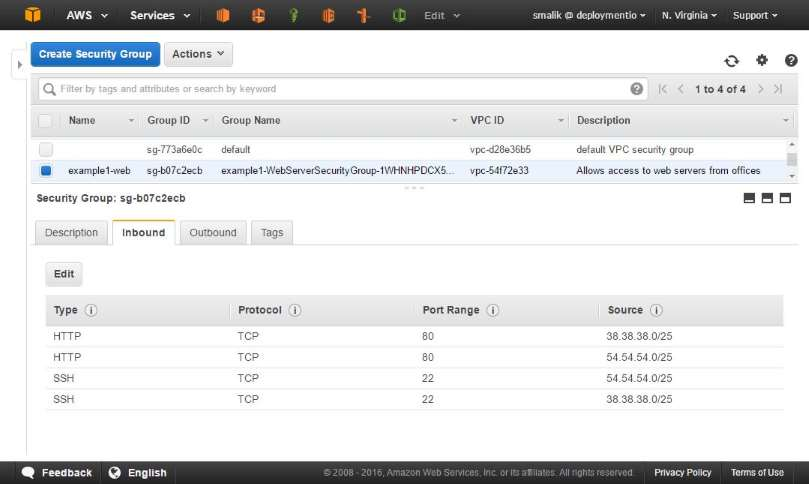

## CFN Stacker - Example #1

This example shows the basic use of cfn-stacker. It creates a CFN stack with a EC2 security group meant to be assigned to web servers. The stack's definition is kept in [`stack.json`](stack.json) - which is needed by cfn-stacker to create this stack. This file references [`security-groups.json`](security-groups.json) which is evaluated by cnf-stacker and eventually sent to CloudFormation api to manage the stack. The features highlighted in this example are:  

- Use of a map, boolean, and simple string parameter.
- Use of velocity VTL `if` statement for some conditional logic. 

### `stack.json`

```json
{
	"name": "example1",
	"s3Bucket": "deploymentio-main",
	"s3Prefix": "cfn-stacker-templates/",
	"tags": {
		"dio:domain": "deploymentio.com"
	},
	"parameters": {
		"environment": "example1",
		"officeIps": {
			"office1": "38.38.38.0/25",
			"office2": "54.54.54.0/25"
		},
		"openToPublic": false
	},
	"fragments": [
		{
			"path": "security-groups.json"
		}
	]
}
```

### `security-groups.json`

```json
{
	"Resources": {
		"WebServerSecurityGroup":{
			"Type": "AWS::EC2::SecurityGroup",
			"Properties":{
				"GroupDescription": "Allows access to web servers from offices#if(${openToPublic}) and public#end",
				"Tags": [
					{ "Key": "Name", "Value": "${environment}-web" }
				],
				"SecurityGroupIngress":[
					#if (${openToPublic})
						{
							"CidrIp": "0.0.0.0/0",
							"FromPort": "80",
							"IpProtocol": "tcp",
							"ToPort": "80"
						},
					#else
						{
							"CidrIp": "${officeIps.office1}",
							"FromPort": "80",
							"IpProtocol": "tcp",
							"ToPort": "80"
						},
						{
							"CidrIp": "${officeIps.office2}",
							"FromPort": "80",
							"IpProtocol": "tcp",
							"ToPort": "80"
						},
					#end				
					{
						"CidrIp": "${officeIps.office1}",
						"FromPort": "22",
						"IpProtocol": "tcp",
						"ToPort": "22"
					},
					{
						"CidrIp": "${officeIps.office2}",
						"FromPort": "22",
						"IpProtocol": "tcp",
						"ToPort": "22"
					}
				]
			}
		}
	}
}
```

- Notice the use of `${..}` variables - the values are retrieved from the `parameters` attributes of `stack.json`.
- Notice the use of `#if(...)` statements in `GroupDescription` and to decide which ingress rules to add for port 80.

### The resulting security group in AWS console

 